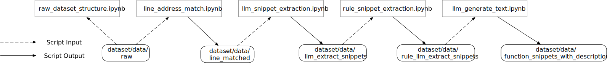
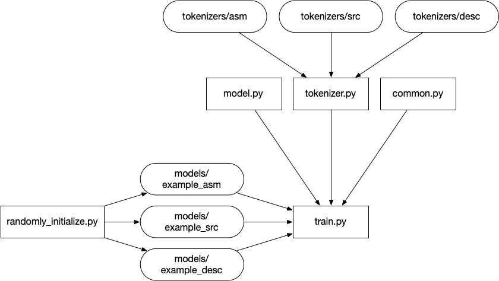

# BinQuery: A Novel Framework for Natural Language-Based Binary Code Retrieval

This repository is used to demonstrate the workflow of `BinQuery`. It includes the following components: 
- Data processing pipeline 
- Model training scripts 
- Model inference in the vulnerability retrieval scenario

## Prerequisites

```bash
pip install -r requirements.txt
```

## Data Preprocess Pipeline

📊 [`dataset/data/raw`](dataset/data/raw): Contains 100 sample data entries that demonstrate the data format and structure, helping you understand the characteristics of the input data.

📝 [`dataset/raw_dataset_structure.ipynb`](dataset/raw_dataset_structure.ipynb): Provides a detailed visualization of the raw dataset structure and organization, serving as a guide when you build your own dataset.

📊 [`dataset/data/line_matched`](dataset/data/line_matched): Dataset created by [`dataset/raw_dataset_structure.ipynb`](dataset/raw_dataset_structure.ipynb), containing line-level matched data that establishes correspondences between source code and binary code.

📝 [`dataset/llm_snippet_extraction.ipynb`](dataset/llm_snippet_extraction.ipynb): Demonstrates how to extract meaningful code snippets from the line-level matched data using Large Language Models (LLMs) for more precise analysis.

📊 [`dataset/data/llm_extract_snippets`](dataset/data/llm_extract_snippets): Dataset produced by [`dataset/llm_snippet_extraction.ipynb`](dataset/llm_snippet_extraction.ipynb), containing refined code snippets extracted from the line-level matched data using LLM techniques.

📝 [`dataset/rule_snippet_extraction.ipynb`](dataset/rule_snippet_extraction.ipynb): Implements an alternative approach to extract code snippets using `tree-sitter`, a parsing library that provides syntactic structure analysis.

📊 [`dataset/data/rule_llm_extract_snippets`](dataset/data/rule_llm_extract_snippets): Comprehensive dataset created by [`dataset/rule_snippet_extraction.ipynb`](dataset/rule_snippet_extraction.ipynb), containing both LLM-extracted snippets and `tree-sitter`-extracted snippets for comparative analysis.

📝 [`dataset/llm_generate_text.ipynb`](dataset/llm_generate_text.ipynb): Selects representative code snippets and generates natural language descriptions for them, creating paired data for training the retrieval model.

📊 [`dataset/data/function_snippets_with_descriptions`](dataset/data/function_snippets_with_descriptions): Dataset created by [`dataset/llm_generate_text.ipynb`](dataset/llm_generate_text.ipynb), which is the final output of our data preprocess pipeline and will be used for model training.

You can follow the order of the diagram below for reading.


## Model Training

📝 [`train.py`](train.py) uses the example data generated from the previous step as the training data.
The training code has been modified slightly, removing `multi-card parallelism`, `checkpoint recovery`, and `training-time testing` mechanisms, but the `loss function` remains exactly the same as in the `BinQuery` experiment. 

📝 [`randomly_initialize.py`](randomly_initialize.py) creates three empty models. The empty models have already been provided in [`models/example_asm`](models/example_asm), [`models/example_desc`](models/example_desc), and [`models/example_src`](models/example_src).
These models are very small, and you can modify the hyper-parameters to train a larger model. 

📝 [`tokenizer.py`](tokenizer.py) is used to tokenize the target data. It has been extensively modified, with inputs including `code` and `code_range`, to adapt to the snippet-level training algorithm proposed by `BinQuery`.

📝 [`common.py`](common.py) contains the `loss function` and `evaluation metrics` used in the `BinQuery` experiment.

You can follow the order of the diagram below for reading.


## Vulnerability Search Execution Record

[`vulnerability_search.ipynb`](vulnerability_search.ipynb)

Here we provide a real CVE retrieval case from the Magma dataset to demonstrate the effectiveness of `BinQuery` retrieval system and showcase the results of our `query augmentation` mechanism.

When running the notebook, we originally placed our pre-trained model in the `models/binquery` directory, but this model was removed during the code upload process due to size constraints.
If you wish to reproduce our results, you can use the data processing pipeline and training code provided in the previous sections to train your own model.

Please note that training a high-quality model requires significant computational resources and time.

# Bibtex

If this work is help for for your research, please consider citing the following Bibtex entry.

```latex
@inproceedings{Zhang2025BinQuery,
  author    = {Zhang, Bolun and Gao, Zeyu and Wang, Hao and Cui, Yuxin and Qin, Siliang and Zhang, Chao and Chen, Kai and Zhao, Beibei},
  title     = {{BinQuery: A Novel Framework for Natural Language-Based Binary Code Retrieval}},
  year      = {2025},
  publisher = {Association for Computing Machinery},
  address   = {New York, NY, USA},
  booktitle = {Proceedings of the ACM on Software Engineering},
  articleno = {ISSTA052},
  numpages  = {22},
  month     = {jul},
  series    = {ISSTA '25},
  volume    = {2},  
  doi       = {10.1145/3728927},
  url       = {https://doi.org/10.1145/3728927},
  note      = {Appears in the Proceedings of the ACM International Symposium on Software Testing and Analysis (ISSTA '25)} 
}
```

